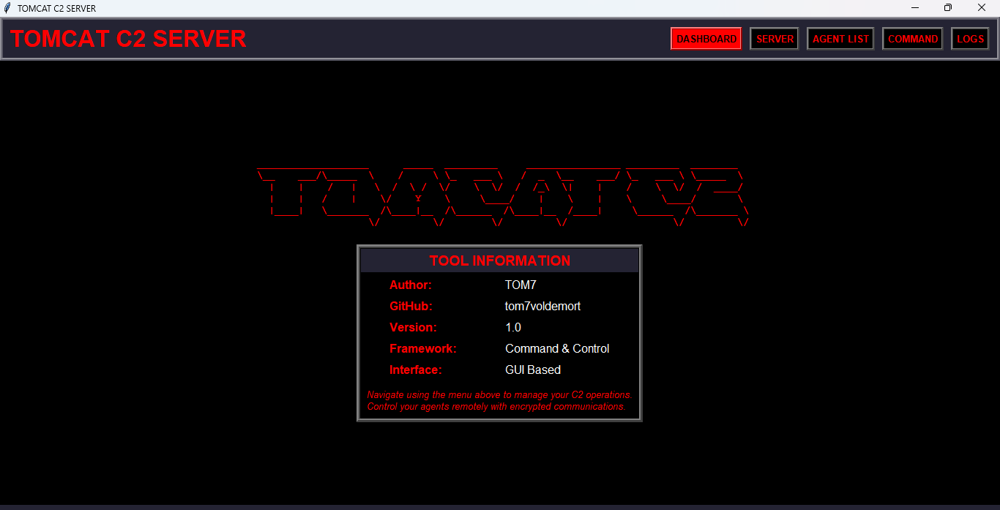
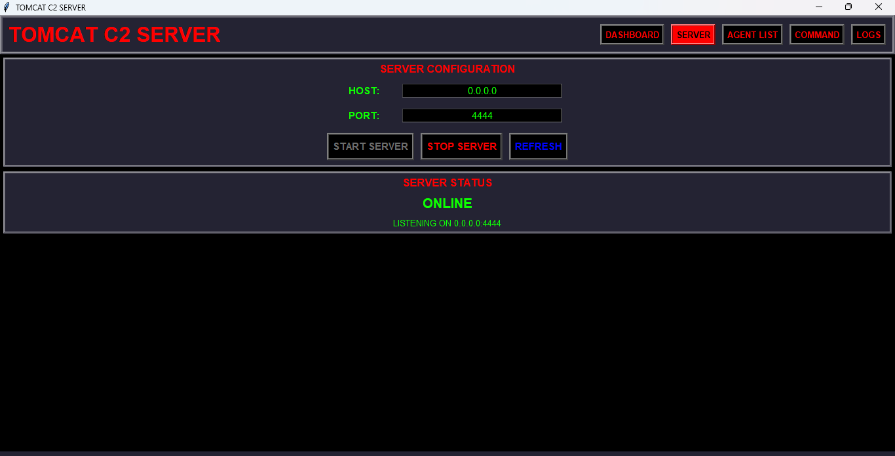
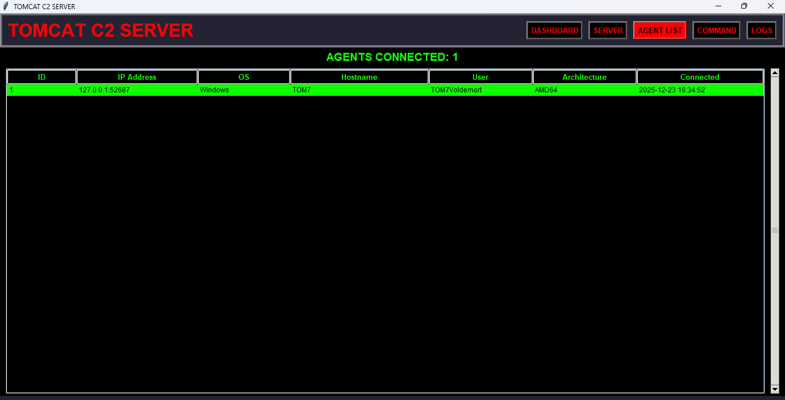
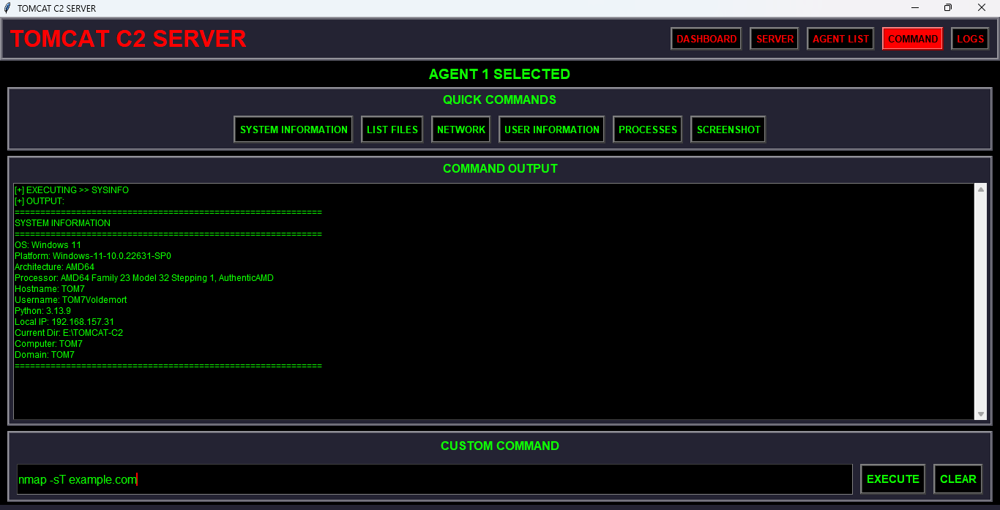
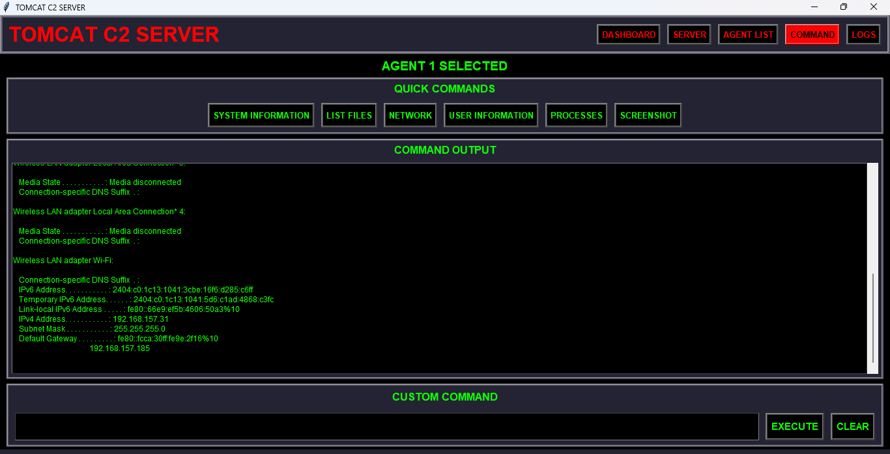
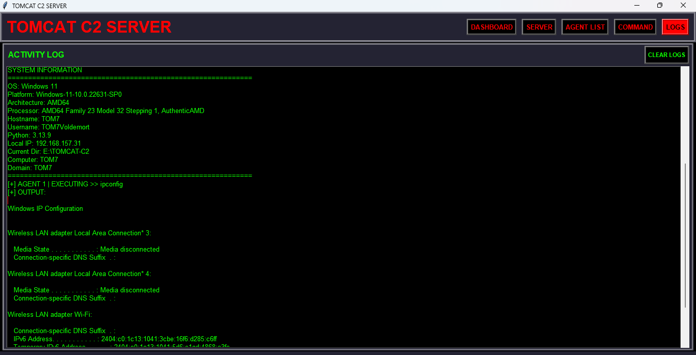

# TOMCAT C2 Framework

## Overview

TOMCAT C2 is a Python-based Command & Control (C2) framework consisting of a **GUI C2 Server** and a **lightweight cross-platform Agent**. The framework enables encrypted remote command execution, system monitoring, file transfer, and basic post-exploitation features over raw TCP sockets. This tools actually on development right now, its not literally finish at all. I will & still update this project.

* Tool Overview

* Server Setup

* Connected Agent List

* Command Execution & Quick Command Center


* Activity Logs


This project is intended strictly for **educational purposes, malware analysis labs, red-team simulations, and controlled security research environments**.

---

## Architecture

* **C2 Server (`tomcatv1s.py`)**

  * GUI-based operator console (Tkinter)
  * Cross-platform (Windows / Linux / MacOS)
  * Multi-agent management
  * Encrypted command & response channel

* **C2 Server `Flask Version` (`tomcatv1sf.py`)**
  * Cross-platform (Windows / Linux / MacOS / Termux)
  * Control Using Flask Server Panel
  * Access at `127.0.0.1:5000` or `<ip address>:<port>` depending on your setup.

* **Normal Agent (`tomcatv1a.py`)**
  * Uses mostly Python advanced modules
  * Cross-platform (Windows / Linux / MacOS / Termux)
  * Remote command execution & system interaction

* **Minimal Agent (`mintomcatv1a.py`)**
  * Uses mostly Python built-in modules
  * Cross-platform (Windows / Linux / MacOS / Termux)
  * Remote command execution & system interaction

---

## Core Features

### C2 Server

* TCP socket-based C2 listener
* Multi-agent support with session tracking
* Encrypted communication using **Cryptography.Fernet**
* Real-time agent monitoring & disconnect detection
* GUI dashboard:

  * Connected agent list
  * System metadata (OS, user, arch, hostname)
  * Interactive command execution
* Built-in quick commands:

  * System information
  * Process listing
  * Network configuration
  * User context
  * Screenshot request

### Agent Capabilities

* Encrypted handshake with server
* Remote shell command execution (Windows & Linux)
* Screenshot capture (OS-dependent)
* File download (read & base64 encode)
* File upload (base64 write to disk)
* System fingerprinting
* Privilege level detection
* Optional persistence mechanisms:

  * Windows Registry Run key
  * Linux Cron `@reboot`
* Automatic reconnect with retry logic

---

## Encryption Model

* Primary: `cryptography.fernet` (symmetric encryption)
* Fallback: XOR-based encryption (agent-side fallback only)
* Session key generated server-side and delivered during handshake

> **Note:** No mutual authentication or certificate pinning is implemented.

---

## Requirements

### Server

* Python 3.8+
* Required modules:

  * cryptography
  * colorama
  * tkinter

### Agent

* Python 3.x
* Minimal agent runs using Python standard library
* Optional features require:

  * cryptography
  * pillow (for screenshots on Windows)

---

## Installation

```bash
git clone https://github.com/tom7voldemort/TOMCAT-C2-Framework.git
cd TOMCATC2-Frameworks
pip3 install -r requirements.txt
```

### Arch Linux

```bash
sudo pacman -S tk
pip3 install -r archlinux-requirements.txt
```

---

## Usage

### Start C2 Server

```bash
python3 tomcatv1s.py
```

* Default bind: `0.0.0.0:4444`
* GUI will display session key and connected agents

### Start Agent

Edit configuration inside `tomcatv1a.py` or `mintomcatv1a.py`:

```python
serverHost = "127.0.0.1"
serverPort = 4444
```

Run Complex Agent:

```bash
python3 tomcatv1a.py
```

Run Minimal Agent:

```bash
python3 mintomcatv1a.py
```

---

## QUICK COMMANDS

| Command               | Description                 |             |
| --------------------- | --------------------------- | ----------- |
| `SYSTEM INFORMATION`             | Detailed system information |             |
| `SCREENSHOT`          | Capture screen (base64)     |             |
| `LIST FILES`           | File listing                |             |
| `USER INFORMATION`              | Current user                |             |
| `PROCESSES` | Process list                |             |
| `NETWORK` | Network Information                |             |
| `DOWNLOAD:<path to file or file>`     | Download file               |             |
| `UPLOAD:<path to file or file>`       | Upload File                 |             |
| `exit`                | Disconnect agent            |             |

---

## Security Notes

* No authentication between server and agent
* Session key transmitted in plaintext during handshake
* No transport obfuscation or TLS
* Persistence features disabled by default

**This framework will be detected as malware by AV/EDR solutions.**

---

## Legal Warning

Unauthorized deployment against systems you do not own or explicitly have permission to test **is illegal**.

The author is **not responsible** for misuse or damage caused by this project.

---

## Author

* **Author:** TOM7
* **GitHub:** tom7voldemort
* **Version:** 1.0
* **Release:** Nov 25, 2025

---

## Support Me

* PayPal: [anonymous999tm@gmail.com](mailto:anonymous999tm@gmail.com)
* Instagram: @tom7_xp
